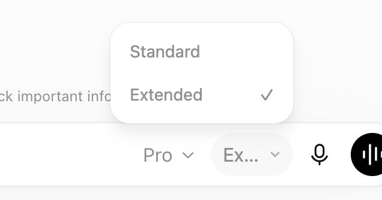
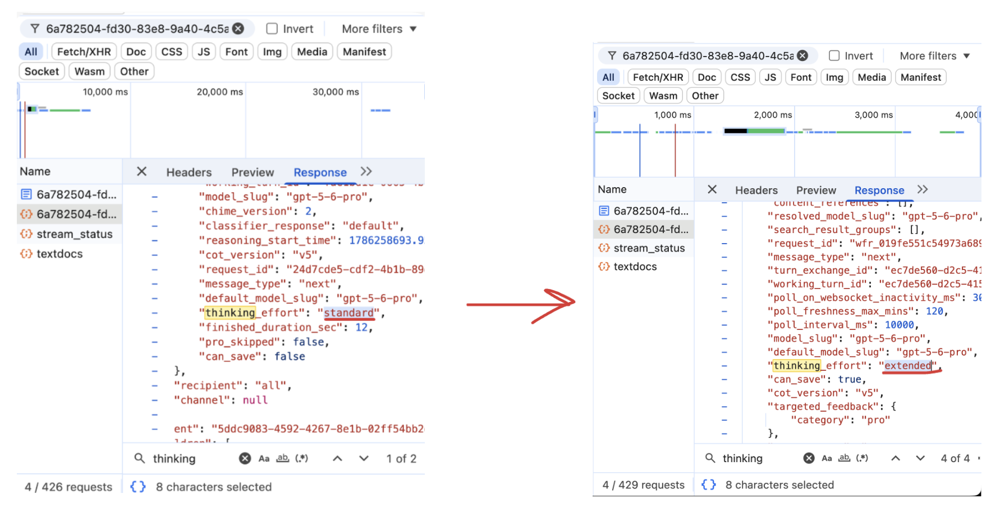

# ChatGPT Pro Effort Selector

> [!IMPORTANT]
> **OpenAI exposed Standard and Extended thinking in GPT-5.5 Pro. GPT-5.6 Pro hides that choice; this extension brings it back.**

<p align="center">
  
</p>

> [!TIP]
> **Verify it yourself after installing the extension**

<p align="center">
  
</p>

## Install: Copy text block below and paste into Codex 5.6 Sol

```text
Download or safely update the ChatGPT Pro Effort Selector from:
https://github.com/ahmedelami/chatgpt-pro-effort-selector

Work autonomously until it is installed and visibly verified in Google Chrome.

1. Read the repository README, `manifest.json`, and relevant source before installing. Explain that this unpacked extension requests Chrome's powerful debugger permission because Extended mode briefly intercepts one ChatGPT request at a time.
2. Use Git or the terminal to clone the repository into the stable local directory `~/chatgpt-pro-effort-selector`.
   - If that directory is absent, clone the repository's default branch there.
   - If it exists, verify it is a Git clone of exactly this repository. Never overwrite, delete, reset, or repurpose an unrelated directory.
   - If the correct clone is clean and on its default branch, fetch and update it with a fast-forward-only pull.
   - If it is dirty, diverged, on another branch, or has a different remote, stop and report the issue without modifying it.
3. From the repository root, run `npm run validate`. Do not run `npm install`; there are no dependencies or build steps. Stop and report any validation failure.
4. Use Computer Use for all Chrome UI actions. Do not use DevTools, Protocol Monitor, CDP, or a browser-control plugin that attaches a debugger to the ChatGPT tab.
5. Open `chrome://extensions`, enable Developer mode, and find ChatGPT Pro Effort Selector.
   - If this same clone is already loaded, click Reload.
   - If a copy from another directory or multiple copies exist, stop and ask me. Do not remove anything or load a duplicate.
   - Otherwise, click Load unpacked and choose the clone directory containing `manifest.json`.
6. If this is a first-time Load unpacked install, wait until immediately before clicking Load unpacked, then explain the debugger-permission risk and ask for the single action-time confirmation required by Computer Use. Batch that one confirmation to cover clicking Load unpacked, choosing exactly the verified `~/chatgpt-pro-effort-selector` directory containing `manifest.json`, and accepting only Chrome's expected debugger-related warning for this extension. After I confirm, continue autonomously without another confirmation. If the same clone is already loaded and only needs Reload, do not ask for confirmation.
7. Open or reload `https://chatgpt.com/`. Without sending a message, select the visible Pro model if needed and verify that a compact selector containing exactly Standard and Extended appears beside it.
8. Confirm Chrome's installed extension version matches `manifest.json`.
9. Do not send a ChatGPT message unless I explicitly ask for a live request test. If I do request one, keep DevTools and every other debugger-based browser tool detached during the Extended send because the extension needs exclusive temporary debugger access.
10. Report the clone path, extension version, validation result, and visible Chrome verification. Leave ChatGPT open and leave the current test chat in Standard mode.
```

A dependency-free Manifest V3 Chrome extension that exposes a compact **Standard / Extended** selector beside ChatGPT's composer model control only when the currently visible model is exactly **Pro** or **GPT-5.6 Pro**.

For each canonical saved conversation, the selector controls a persistent per-chat mode. While that chat is Extended, every captured normal composer submission freshly uses the existing short-lived one-shot debugger gate. Sending, failing, timing out, warning, or verifying an individual request does not consume or reset the chat mode.

The extension does not replace, suppress, or modify ChatGPT's own model menu. Its submission coverage is limited to the normal composer send button, Enter, and form-submit paths handled by the content script. It does not claim to cover regenerate, retry, branch, or other non-composer controls.

The selector mounts beside the model-control branch in the nearest horizontal composer-control layout rather than inserting inside the model control's internal vertical wrapper. Its popover is a viewport-aware, compact native-style picker containing only two rows: **Standard** and **Extended**.

> [!WARNING]
> This is an unofficial extension that depends on unsupported ChatGPT internals and requests Chrome's powerful `debugger` permission. Review the source before installing it. ChatGPT or Chrome changes can break it without notice.

## Directory

The unpacked-extension directory is the cloned repository root:

```text
chatgpt-pro-effort-selector/
```

The complete layout is:

```text
chatgpt-pro-effort-selector/
├── LICENSE
├── manifest.json
├── package.json
├── README.md
├── background/
│   └── service-worker.mjs
├── content/
│   ├── content-script.js
│   ├── shadow-ui.js
│   └── styles.css
├── core/
│   ├── mode-core.js
│   ├── request-core.mjs
│   ├── state-core.mjs
│   └── verification-core.mjs
├── docs/
│   └── images/
│       ├── pro-effort-selector.png
│       └── standard-to-extended-thinking-effort.png
└── tests/
    ├── mode-core.test.mjs
    ├── request-core.test.mjs
    ├── state-core.test.mjs
    ├── ui-core.test.mjs
    ├── ui-shadow-contract.test.mjs
    └── verification-core.test.mjs
```

No build step, package installation, remote code, or third-party runtime dependency is used.

## Standard behavior

Standard is the default mode for every canonical saved conversation whose stored mode is missing, deleted, malformed, or otherwise unexpected.

In Standard mode:

- ChatGPT requests are untouched.
- No request body or header is inspected.
- `chrome.debugger` is not attached.
- Chrome's debugger infobar should not appear.
- Other ChatGPT models continue to work normally.

Each canonical saved conversation uses an independent `chrome.storage.local` key:

```text
proEffortMode.chat.<lowercase conversation UUID> = "standard" | "extended"
```

Chat A and Chat B therefore remain independent. Tabs showing the same canonical conversation synchronize mode changes through `chrome.storage.onChanged`, while storage changes for unrelated conversations are ignored.

### Legacy migration

Earlier versions used one global local-storage key:

```text
effortPreference
```

That legacy key is retired on startup and is never consulted as a fallback. In particular, an old global Extended value is not copied into every conversation. Existing conversations without a valid per-chat key safely default to Standard until explicitly changed.

### Blank new-chat draft

A blank new chat has no canonical conversation UUID, so its mode is kept in that tab's `sessionStorage` until the draft becomes a saved conversation:

- it defaults to Standard
- selecting either option survives reloads in the same tab
- selecting Extended applies to its first captured normal Pro composer submission
- ChatGPT's provisional `/c/WEB:<lowercase UUID>` URL is treated as the same new-chat lifecycle, so it does not cancel the first Extended send or become a persistent storage identity
- once that send is known to have succeeded and exactly one newly active canonical `/c/<lowercase UUID>` conversation appears, the selected mode is written to that conversation's independent key
- while ChatGPT still displays the provisional `WEB:` URL, a bounded tab-session path-to-conversation map points mode reads and changes at that canonical conversation; reloading or returning with Back therefore preserves the chat's current selection
- while first-send correlation is still finishing, a short-lived generation-scoped pending record survives a same-tab reload; it may resume binding only when the background reports that exact generation as sent, warning, or verified with a submitted user-message id
- a pass-through Standard first send is tracked across the draft-to-saved route boundary, so selecting Extended before ChatGPT finishes assigning the new URL still binds Extended to the created conversation
- merely navigating from a blank draft to an existing saved conversation does not copy the draft mode
- a later blank new chat defaults to Standard
- a fresh tab has its own Standard draft default, and closing the original tab clears its unsent draft mode with the browser session

## Per-chat Extended mode and per-send one-shot gate

Extended applies to a captured composer submission only when:

1. the current canonical conversation's stored mode, or the current tab-session blank-chat draft mode, is Extended; and
2. the extension can identify the exact visible composer model as `Pro` or `GPT-5.6 Pro`.

The selector is not shown for GPT-5.6 Sol, and a fresh Sol request is never rewritten to Pro.

For every captured normal send-button, Enter, or form submission while that chat remains Extended:

1. The content script captures and stops the original UI event before ChatGPT can process it.
2. The background service worker creates browser-session-only one-shot state.
3. The service worker attaches `chrome.debugger` to that exact tab and waits for Chrome's acknowledgement.
4. It calls `Fetch.enable` with exactly two request-stage patterns:
   - `*://*/backend-api/f/conversation*`, resource type `XHR`
   - `*://*/backend-api/f/conversation*`, resource type `Fetch`
5. The content script performs a final current-tab, current-document, current-path, and current-generation arm check.
6. Before acknowledging that check, the service worker records browser-session-only replay authorization.
7. The content script marks that exact generation as starting its native UI replay, and the service worker persists the generation-scoped handshake.
8. Only then does the content script replay the normal ChatGPT UI action once.
9. Every unrelated paused request is continued immediately.
10. The only qualifying request is a fresh `POST` whose parsed pathname is exactly:
   - `/backend-api/f/conversation`
11. `/backend-api/f/conversation/prepare`, a trailing-slash route, and all other routes are unrelated.
12. Exactly one qualifying pause must occur within 10 seconds.
13. The fresh body must:
    - be valid JSON
    - have `model === "gpt-5-6-pro"`
    - own string property `thinking_effort`
    - own string property `client_prepare_state`
    - contain a nonempty newest user message id
14. A fresh semantic JSON clone is created.
15. Only these top-level values are assigned:
    - `model = "gpt-5-6-pro"`
    - `thinking_effort = "extended"`
    - `client_prepare_state = "none"`
16. All other fresh body fields, including the fresh user message id, are preserved.
17. Fresh request headers are preserved except:
    - `x-conduit-token`
    - `content-length`
18. Header-name matching is case-insensitive.
19. Header values are never logged or persisted.
20. The same paused request is continued with the modified UTF-8 JSON encoded as base64 and the filtered fresh headers.
21. Immediately after Chrome acknowledges that continuation, the extension clears interception with:

```text
Fetch.enable({ patterns: [] })
```

22. The extension never calls `Fetch.disable`.
23. The extension then detaches the debugger.

That debugger/request operation is one-shot for one fresh composer submission. After it ends, the conversation's Extended mode remains selected. A later captured composer submission in the same chat creates a new generation and freshly repeats the arm, confirmation, replay, mutation, continuation, and cleanup lifecycle.

Changing the current conversation back to Standard is the normal way to end its Extended mode. Request success, warning, failure, timeout, cleanup state, uncertainty, or durable verification does not reset or consume the saved mode.

A malformed request, missing field, missing user id, model mismatch, duplicate qualifying pause, timeout, navigation, tab closure, attach failure, CDP failure, or pre-send debugger detach does not intentionally fall back to Standard.

After replay authorization has been acknowledged, a detach, navigation,
timeout, service-worker restart, or missing qualifying pause cannot always be
proved to have blocked the page's request. Such a case is reported as
**Extended outcome uncertain**, never as definitely blocked and never as
Verified Extended.

## SPA navigation and route isolation

ChatGPT can replace conversation routes without reloading the document.

On SPA navigation, the content script:

- treats a change between canonical conversations, or between a saved conversation and a draft route, as a route transition
- clears the prior route's generation, submitted-message, status, verification, and related operation UI before presenting the destination route
- loads the destination saved conversation's independent mode before a captured submission is allowed to replay
- blocks rather than replaying a captured submission if the destination mode cannot be loaded or the route changes again during that load
- preserves conservative fail-closed or outcome-uncertain handling when navigation interrupts an active one-shot operation
- permits only one replay-authorized, same-document blank-chat to exact `/c/WEB:<lowercase UUID>` transition during the active first-send lifecycle
- uses `webNavigation` document identity to distinguish that History API transition from a reload or full-document navigation even when Chrome splits URL and `loading` updates across separate events
- permits one later `WEB:` to canonical promotion only after the same generation continued a request with a submitted user-message id and the content script correlated the exact canonical target to the unique newly active conversation
- keeps full-document loading, unrelated paths, an uncorrelated canonical target, and a second provisional or canonical transition fail-closed

When an allowed history transition is accepted, the background updates the active operation's recorded pathname before persisting it. `tabs.onUpdated` alone never authorizes the route change. The background state API otherwise restores only a currently active operation whose recorded pathname matches the requesting page. A completed or unrelated tab audit is not restored into the destination chat.

## Duplicate protection

The first qualifying request is held paused for a short 75 ms settling interval.

This gives another qualifying pause already in flight a chance to surface before the first request is continued. A duplicate observed before continuation causes the retained qualifying requests to be aborted where Chrome still permits it.

If a later duplicate arrives after the first request has already been continued as Extended, the later pause is aborted and a temporary warning toast appears rather than pretending the first send never occurred. If Chrome does not confirm that the duplicate was aborted, the state becomes **Extended outcome uncertain**.

## Chrome debugger warning

The `debugger` permission is required and is not optional for this design.

Chrome can:

- show a strong extension-installation warning
- show an infobar while the extension is attached
- report that the tab is being debugged

The extension minimizes attachment duration by attaching only immediately before an Extended submission and detaching after the one qualifying request.

## DevTools conflict

Opening DevTools for a tab while this extension is attached to that tab detaches the extension debugger.

The extension handles `chrome.debugger.onDetach` conservatively:

- before a qualifying request is continued, a temporary toast reports a blocker or an explicitly uncertain outcome
- after the request is known to have been continued as Extended, a temporary toast reports a send warning

An external debugger detach is not transactionally atomic with a page request. Chrome can detach after replay authorization but before the resulting network pause. In that interval the extension cannot prove that an untouched request did not escape, so it reports **Extended outcome uncertain**.

Do not open DevTools while the state is **Arming** or while Chrome's debugger indication remains visible.

Durable verification is disabled while an active debugger cleanup remains in
progress, preventing verification state from racing cleanup state.

## Service-worker restart handling

The extension mirrors only redacted audit fields and minimal operational one-shot identifiers into `chrome.storage.session`.

`chrome.storage.session` is memory-scoped to the browser session. It is not the persistent per-conversation `chrome.storage.local` mode store.

The operational state can include:

- tab id
- document id
- one-shot generation id
- lifecycle phase
- tab pathname
- whether the request was already continued
- whether normal-UI replay had been authorized
- paused CDP request ids needed to abort after a service-worker restart

It never contains:

- prompt text
- response text
- request bodies
- cookies
- authorization values
- header values
- full headers

When a new service-worker instance finds a stale active record, it:

1. aborts any retained paused request ids where Chrome still allows it
2. clears Fetch patterns using `Fetch.enable({ patterns: [] })`
3. detaches its debugger target
4. marks the operation blocked, uncertain, or sent-with-warning according to the last safely recorded phase

A stale paused request that cannot be conclusively aborted is reported as **Extended outcome uncertain**, not as Standard and not as Verified Extended. A stale operation with no paused request is also uncertain when replay authorization had already been acknowledged.

If detachment succeeds but explicit pattern clearing is not acknowledged, the
active tab slot is retired with a warning because detachment releases interception. If detachment itself repeatedly fails, the active slot remains blocked rather than permitting a second debugger operation over an unresolved first operation.

Reloading or updating the extension clears `chrome.storage.session`. Chrome normally detaches debugger sessions when the extension reloads. Any later orphan pause is handled conservatively if Chrome delivers it to the new worker.

## Redacted audit

The latest operation for each tab uses only this redacted audit shape:

- method
- exact pathname
- resource type
- original and forced `model`
- original and forced `thinking_effort`
- original and forced `client_prepare_state`
- names, not values, of removed headers
- submitted user message id
- generation id
- status
- error code

No request body, prompt, response, cookie, authorization value, or header value is retained.

No telemetry is sent.

No sensitive data is written to the console.

## Durable verification

Interception success is not durable proof of what ChatGPT saved.

The codebase retains a maintenance-only durable verifier, but the minimalist selector intentionally exposes no **Verify** action or verification text.

The extension does not automatically reload or navigate the page.

Verification requires the current canonical saved conversation path:

```text
https://chatgpt.com/c/<lowercase UUID>
```

When invoked by maintenance instrumentation, the verifier:

1. runs a locally packaged function in ChatGPT's MAIN JavaScript world
2. performs a same-origin credentialed GET to:

```text
/backend-api/conversation/<conversation UUID>
```

3. does not read or return cookie values
4. does not read or return authorization values
5. parses the durable response in page context
6. follows only the active branch from `current_node`
7. examines ids, parent links, roles, type markers, proof metadata, status, and `end_turn`
8. does not inspect or return message text or content parts
9. locates the retained submitted user message id on the active branch
10. isolates that user's turn, ending at the next non-ignored user node
11. ignores:
    - `reasoning_recap`
    - `model_editable_context`
12. returns to the extension only a redacted correlated turn
13. requires exactly one non-ignored proof-bearing assistant response
14. requires that assistant to have:
    - `metadata.model_slug === "gpt-5-6-pro"`
    - `metadata.thinking_effort === "extended"`
    - `status === "finished_successfully"`
    - `end_turn === true`
15. refuses to run while debugger cleanup is still active

Only then does the internal verifier classify the response as **Verified Extended**.

The two-option picker intentionally exposes no status or verification controls. If the internal durable endpoint or schema changes, the verifier returns an unavailable result rather than fabricating proof.

## Verification maintenance

Maintainers can validate the proof classifier with `npm test`; no verification action, submitted-message details, or result text is added to the picker.

## Permissions

### `https://chatgpt.com/*`

Restricts content-script and same-origin verification access to ChatGPT.

### `storage`

Used for:

- independent persistent Standard / Extended modes for canonical saved conversations in `chrome.storage.local`
- same-conversation tab synchronization through `chrome.storage.onChanged`
- deterministic retirement of the obsolete global `effortPreference` key
- ephemeral redacted one-shot state in `chrome.storage.session`

The unsaved blank-chat mode uses the page's same-origin `sessionStorage`, not the extension `storage` permission. It stores the scalar string `standard` or `extended`. After a provisional `WEB:` chat is correlated to exactly one saved conversation, it also keeps a bounded map of recent temporary paths to canonical conversation UUIDs so reloads and same-tab Back navigation keep using each saved chat's mode. During first-send correlation, a maximum-two-minute pending record contains only the generation id, selected mode, route identifiers, timestamp, and preexisting conversation keys; recovery still requires matching successful background state. It never stores prompt or response content.

### `debugger`

Required for CDP Fetch interception of the single fresh Extended request.

This is a powerful permission and causes a Chrome warning.

### `scripting`

Supports the maintenance-only redacting verification path in ChatGPT's MAIN world. The ordinary two-option picker does not invoke it.

### `webNavigation`

Distinguishes an exact same-document ChatGPT History API route update from a top-frame reload or committed navigation while a one-shot Extended operation is active. It is scoped by the extension's `https://chatgpt.com/*` host permission.

No remote script is loaded.

## Load unpacked

1. Clone the repository into a stable local folder:

```bash
git clone https://github.com/ahmedelami/chatgpt-pro-effort-selector.git
cd chatgpt-pro-effort-selector
```

2. Open:

```text
chrome://extensions
```

3. Enable **Developer mode**.
4. Select **Load unpacked**.
5. Choose the cloned repository root containing `manifest.json`:

```text
chatgpt-pro-effort-selector/
```

6. Accept Chrome's debugger-related warning.
7. Open or reload:

```text
https://chatgpt.com/
```

No build or install command is required.

## Automated validation

From the extension root:

```bash
node --check background/service-worker.mjs
node --check content/shadow-ui.js
node --check content/content-script.js
node --check core/mode-core.js
node --check core/request-core.mjs
node --check core/verification-core.mjs
node --check core/state-core.mjs
node --test
```

The convenience command is:

```bash
npm run validate
```

`npm install` is not required.

## Manual QA checklist

Use a unique marker in every test prompt. When checking backend metadata, keep DevTools, Protocol Monitor, and other debugger-based browser tooling detached until the response is complete and Chrome's Extended debugger indication is gone. Detach the inspector again before every later Extended send.

### Exact Pro visibility

1. Open ChatGPT with a non-Pro model selected.
2. Confirm the extension selector is absent.
3. Select the visible Pro model.
4. Confirm the selector appears beside the composer model control.
5. Select GPT-5.6 Sol.
6. Confirm the selector disappears.
7. Confirm no GPT-5.6 Sol request is rewritten to Pro.
8. Navigate between chats using ChatGPT's SPA navigation.
9. Confirm only one selector exists after rerenders.

### Native visual behavior

1. Test in light mode.
2. Test in dark mode.
3. Confirm Pro and the effort selector remain in one horizontal composer-control row.
4. Confirm the selector never stacks underneath Pro or overlaps the mic, voice, or send controls.
5. Confirm the closed selector clearly shows Standard or Extended with a compact menu chevron.
6. Confirm the selector is a soft, borderless 36 px composer pill using the nearby model control's font, foreground, and background tokens where available.
7. Confirm the open picker is approximately 152 px wide with a 16 px radius and exactly two 36 px single-line choice rows: Standard and Extended.
8. Confirm selection is communicated by the right-side checkmark, with no persistent selected-row fill and only a restrained hover surface.
9. Confirm the picker never adds a heading, descriptions, status text, verification controls, or a wider operational section.
10. Resize to a narrow viewport and confirm the popover remains fully on-screen and scrolls internally when necessary.
11. Resize or scroll the composer and confirm the open popover continues tracking the trigger.

### Accessibility

1. Reach the selector with Tab.
2. Press Enter or Space to open it.
3. Confirm focus enters the selected radio option.
4. Confirm the options expose:
   - `role="radio"`
   - `aria-checked`
5. Use Left, Right, Up, and Down arrows.
6. Use Home and End.
7. Press Escape.
8. Confirm the popover closes and focus returns to its trigger.
9. Reopen it and click outside.
10. Confirm outside-click dismissal.
11. Confirm the selected option is announced through `aria-checked` and shown with a right-side checkmark rather than a persistent filled card.
12. Change the preference and exercise operational phases with the picker both open and closed.
13. Confirm each non-error phase change is announced once politely and each error is announced once as an alert without adding visible picker text.

### Standard

1. Select Standard.
2. Submit through the send button.
3. Submit with Enter.
4. Confirm Shift+Enter still inserts a newline.
5. Confirm no debugger infobar appears.
6. Confirm ChatGPT requests behave normally.
7. Reload the page.
8. Confirm Standard remains selected for that conversation.

### Extended send button

1. Select the exact visible Pro model.
2. Select Extended.
3. Reopen the selector and confirm Extended has the selected check and the picker still contains only Standard and Extended.
4. Enter a prompt.
5. Press the normal ChatGPT send button.
6. Confirm Chrome briefly shows its debugger indication.
7. Confirm exactly one user submission occurs.
8. Confirm the picker never adds status or verification text during the send.
9. Confirm the debugger indication disappears promptly.
10. Enter a second prompt in the same conversation without changing the selector.
11. Press the normal send button again.
12. Confirm a fresh one-shot generation is armed and the second request is also sent Extended.
13. Confirm the conversation remains Extended after success, warning, verification, failure, or timeout.

### Extended keyboard send

1. Select Pro and Extended.
2. Enter a prompt.
3. Press Enter.
4. Confirm exactly one submission occurs.
5. Confirm Extended remains selected after the submission.
6. Confirm Shift+Enter does not arm and still inserts a newline.

### Independent saved-conversation modes

1. Open canonical saved Chat A and canonical saved Chat B.
2. Select Extended in Chat A.
3. Leave Chat B Standard.
4. Navigate from A to B using ChatGPT's SPA navigation.
5. Confirm B loads Standard before any captured submission is replayed.
6. Confirm neither chat adds operational text to the picker.
7. Submit normally in B and confirm no debugger attachment occurs.
8. Navigate back to A.
9. Confirm A remains Extended.
10. Reload both conversations while A is Extended and B is Standard, then confirm both modes.
11. Select Standard in A and Extended in B.
12. Reload both conversations again and confirm A is Standard and B is Extended.
13. Confirm each chat's marked backend result matches its selected mode.

### Saved-chat reload transition matrix

Run this five-send sequence in one canonical chat, using a unique marker for every prompt:

1. Start Standard, send marker 1, and confirm its backend metadata is Standard.
2. Reload, confirm Standard, send marker 2, and confirm backend Standard. This proves Standard → Standard.
3. Select Extended, reload, confirm Extended, send marker 3, and confirm durable backend Extended proof. This proves Standard → Extended.
4. Reload, confirm Extended, send marker 4, and confirm durable backend Extended proof. This proves Extended → Extended.
5. Select Standard, reload, confirm Standard, send marker 5, and confirm backend Standard. This proves Extended → Standard.
6. Rapidly select Standard → Extended → Standard, reload, and confirm the last selection wins.
7. Rapidly select Extended → Standard → Extended, reload, and confirm the last selection wins, then restore Standard after backend inspection is detached.

### Same-conversation tab synchronization

1. Open the same canonical saved conversation in two tabs.
2. Select Extended in the first tab.
3. Confirm the second tab changes to Extended.
4. Reload the second tab, confirm Extended, then submit and verify backend Extended.
5. Select Standard in the second tab.
6. Confirm the first tab changes to Standard.
7. Reload the first tab, confirm Standard, then submit and verify backend Standard.
8. Change a different conversation in a third tab.
9. Confirm the first two tabs ignore that unrelated storage change.

### Blank new-chat adoption

1. Open a fresh blank new chat with no canonical `/c/<UUID>` path and confirm Standard.
2. Reload, confirm Standard, send a unique marker, wait for the canonical route, confirm backend Standard, reload, and confirm the saved chat remains Standard.
3. Open a later blank new chat and confirm it defaults to Standard.
4. Select Extended but do not send, reload, and confirm the same blank draft remains Extended.
5. Send a unique marker, wait for success and the canonical route, confirm durable backend Extended proof, reload, and confirm the saved chat remains Extended.
6. Open a later blank new chat and confirm it defaults to Standard.
7. Select Extended in a blank draft without sending, navigate directly to an existing saved Standard conversation, and confirm the existing conversation remains Standard.
8. Open another blank new chat in that same tab and confirm it starts Standard rather than resurrecting the abandoned draft selection.
9. Open a separate fresh ChatGPT tab and confirm its blank draft starts Standard.
10. In a controlled harness, or manually when the timing is reproducible, submit a Standard first message and select Extended before ChatGPT assigns the canonical route.
11. Confirm that first marked request remained backend Standard, reload and confirm the created chat is Extended, then send a second marker and confirm backend Extended.

### Legacy migration

1. Before loading the revised extension, create the old local-storage value `effortPreference = "extended"`.
2. Load or reload the revised extension.
3. Confirm the legacy key is removed, or remains inert if Chrome reports a removal failure.
4. Open multiple saved conversations with no per-chat mode keys.
5. Confirm none silently inherit the old global Extended value.
6. Confirm each missing or corrupt per-chat value resolves to Standard.

### Click activation, cancellation, and recursion

1. Press and hold the primary mouse button on the send control.
2. Move the pointer away from the control and release it.
3. Confirm the cancelled click neither arms Extended nor submits the prompt.
4. Use a complete physical mouse click on the send button.
5. Confirm exactly one one-shot operation and one user submission occur.
6. Double-click rapidly.
7. Confirm only one one-shot operation is active.
8. Confirm a later physical click is blocked while Arming.

### Timeout

1. Select Extended.
2. Trigger a send in a state where ChatGPT does not produce the exact conversation POST.
3. Wait approximately 10 seconds.
4. Confirm the operation reports **Extended outcome uncertain** after replay authorization, or a definite blocker if replay was explicitly cancelled before dispatch.
5. Confirm it is never reported as Verified Extended without durable proof.

### Model mismatch

1. Select Extended while Pro is visible.
2. Change the model during the arm/replay boundary if reproducible.
3. Confirm a fresh non-Pro body is aborted rather than rewritten.
4. Confirm the error names the Pro model mismatch.

### Duplicate qualifying requests

1. Use a controlled test harness or breakpoint-free environment capable of generating two matching conversation POSTs from one replay.
2. Confirm a second pause observed before continuation causes the paused qualifying requests to be aborted where possible.
3. If the duplicate arrives after the first request was already sent Extended, confirm a temporary warning toast appears while the picker remains unchanged.

### DevTools detach

1. Open DevTools before submitting.
2. Attempt Extended.
3. Confirm attachment fails clearly.
4. Close DevTools.
5. Start another Extended send.
6. Open DevTools while Arming.
7. Confirm the extension reports a blocker or explicitly uncertain outcome.
8. Confirm it never labels the result Verified Extended without durable proof.

### Navigation and tab closure

1. Start an Extended operation.
2. Navigate to another ChatGPT route immediately.
3. Confirm the one-shot operation is cancelled or marked uncertain.
4. Start another operation and close the tab.
5. Confirm no other ChatGPT tab is affected.
6. During an A-to-B SPA transition, attempt a normal composer submission before B's storage read completes.
7. Confirm the original event is stopped and is replayed only after B's mode is loaded, or remains blocked if loading fails or the route changes again.
8. Confirm a terminal status from A's retired generation cannot overwrite B's UI.
9. Confirm the destination route does not restore an unrelated completed tab audit as its own Sent or Verified state.

### Multiple tabs

1. Open two ChatGPT tabs.
2. Select Pro in both.
3. Submit Extended in each independently.
4. Confirm each operation is bound to its own tab and generation.
5. Confirm a failure in one tab does not alter the other tab's audit.
6. Confirm a detached cleanup-warning session does not permanently prevent a later operation in that tab.

### Service-worker restart

1. Start an Extended operation.
2. From `chrome://serviceworker-internals` or the extension inspection page, stop the service worker without reloading the extension.
3. Cause the worker to wake.
4. Confirm stale paused request ids are aborted where possible.
5. Confirm the debugger patterns are cleared and detachment is attempted.
6. Confirm the result is blocked, uncertain, or sent-with-warning according to the safely retained phase.
7. Confirm it is never silently promoted to Verified Extended.

### Extension reload

1. Start an Extended operation.
2. Reload the extension from `chrome://extensions`.
3. Confirm no request body, header values, prompt, or response is restored.
4. Confirm each canonical conversation's persistent mode remains.
5. Confirm the page can recover to a new Ready state after reload.

### Durable verification

1. Run `npm test`.
2. Confirm the proof classifier accepts only matching model, effort, completion status, and `end_turn`.
3. Confirm mismatched, incomplete, ambiguous, stale-branch, and cyclic mappings fail.
4. Confirm no verification state adds visible content to the two-option picker.

## Threat and privacy note

The debugger permission is powerful. A conversation may remain persistently Extended, but the debugger is not persistently attached. The extension attaches only for one fresh captured composer submission at a time in the exact ChatGPT tab, then detaches as quickly as the one-shot lifecycle permits.

The request body must be parsed transiently to validate and clone the fresh request, but it is never logged, persisted, or included in audit state.

Durable verification parses the internal conversation response in page context. Only redacted structural and proof metadata for the correlated turn crosses back to the extension.

There is no telemetry, remote code, dynamic code evaluation, `eval`, or `new Function`.

## Known brittleness

This extension depends on unsupported ChatGPT internals:

- composer DOM structure
- accessible model-control semantics
- exact visible Pro labels
- the `/backend-api/f/conversation` request
- request JSON fields
- request header behavior
- the durable conversation endpoint
- durable mapping structure
- assistant metadata fields

ChatGPT can change any of these without notice.

The trigger and picker use separate open Shadow DOM roots with extension-owned styles, so ordinary ChatGPT CSS changes cannot restyle their internal buttons, chevron, rows, or hover surface. The light-DOM toast remains outside that isolation. Shadow DOM is not a security boundary and does not protect the surrounding composer layout, model-control discovery, or mount-point selection from future ChatGPT DOM changes.

The extension intentionally blocks Extended or withholds durable verification when required structure no longer matches. Updates to ChatGPT may require maintenance.

## License

[MIT](LICENSE)
